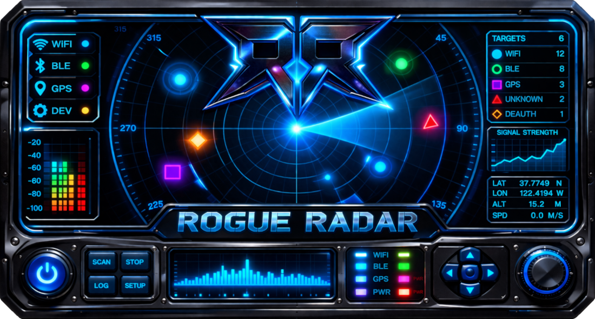
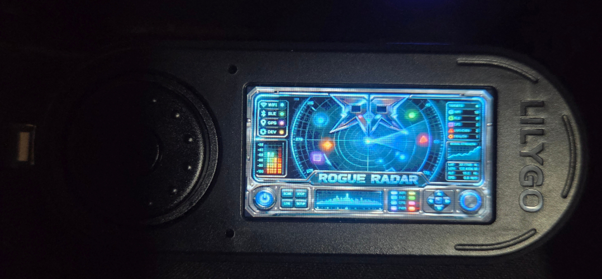
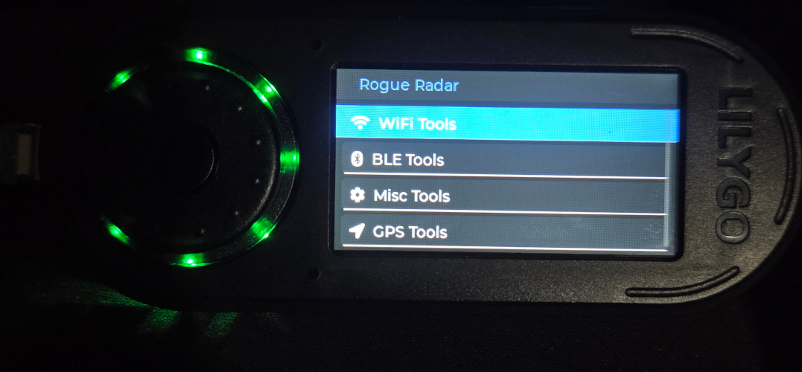
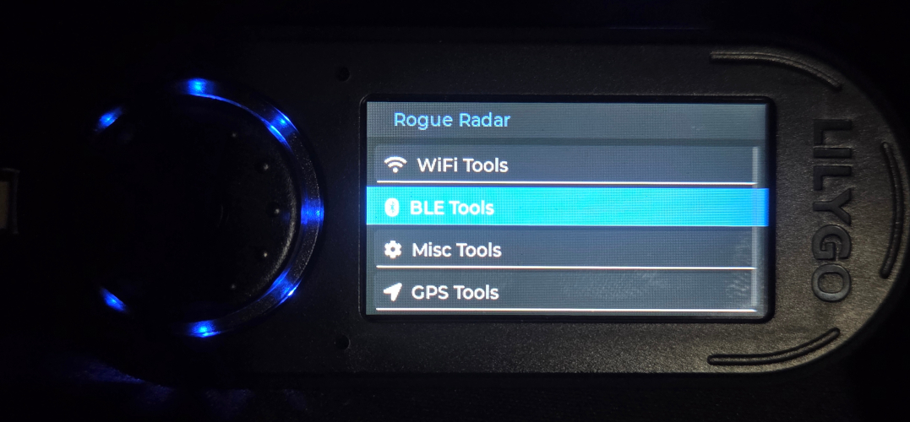
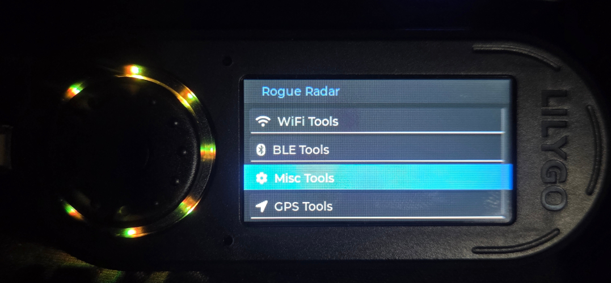
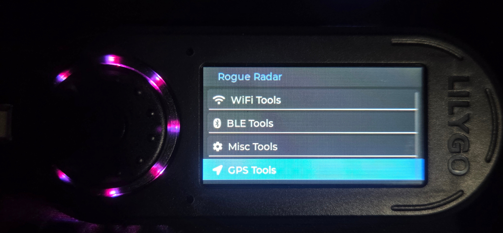

<p align="center">
  
</p>

<h1 align="center">Rogue Radar</h1>
<p align="center"><strong>ESP32-S3 multi-tool firmware for WiFi, BLE, GPS, and device utilities on the LilyGO T-Embed (non CC1101).</strong></p>

## 🧭 Version Tracker

| Version | Status | Notes |
|--------|--------|-------|
| v1.0.0 | Stable | Initial public release of the Rogue Radar Firmware |

> **Latest Release:** `v1.0.0` — Rogue Radar Firmware
---

## Overview

**Rogue Radar** is a handheld ESP32-S3 firmware built for the **LilyGO T-Embed** that combines multiple wireless and utility tools into one rotary-driven interface.

The firmware uses **LVGL** for the UI, **TFT_eSPI** for the 320x170 ST7789 display, **BLE + WiFi** features from the ESP32 core, **TinyGPS++** for GPS data, and **APA102 LEDs** for visual status feedback.

It is designed around fast menu navigation, onboard scanning tools, live signal data, GPS stats, SD-based update support, and a clean embedded dashboard feel.

## Screenshots

<p align="center">
  
  
  
</p>

<p align="center">
  
  
</p>

---

## Current Tool Set

### WiFi Tools
- **Network Scanner** – scans nearby access points and shows SSID, BSSID, RSSI, channel, and security type.
- **Deauth Detector** – monitors for deauthentication activity using promiscuous mode.
- **Channel Analyzer** – surveys channel activity and signal strength across WiFi channels.
- **PineAP Hunter** – watches for BSSIDs cycling through many SSIDs across scans.
- **Pwnagotchi Watch** – looks for Pwnagotchi beacon behavior and parses status data from beacon SSIDs.
- **Flock Detector** – flags WiFi activity associated with networks containing `flock` in the SSID.

### BLE Tools
- **BLE Scanner** – scans nearby Bluetooth Low Energy devices and lists signal details.
- **AirTag Detector** – identifies AirTag-like BLE activity.
- **Flipper Detector** – looks for BLE patterns associated with Flipper-style devices.
- **Skimmer Detector** – checks for HC-03 / HC-05 / HC-06 type modules often used in skimmer-style builds.
- **Meta Detector** – looks for Meta / Ray-Ban smart-glasses related BLE advertisements.

### Misc Tools
- **Device Info** – shows chip, flash, heap, CPU, SDK, and MAC details.
- **SD Update** – supports firmware update flow from SD card.
- **Brightness** – adjusts the TFT backlight with PWM brightness control.

### GPS Tools
- **GPS Stats** – displays live latitude, longitude, speed, altitude, and satellite data.
- **Wiggle Wars** – included as a GPS menu item for expansion / custom use.

---

## Hardware Target

This firmware is currently built around the **LilyGO T-Embed ESP32-S3**.

### Main hardware used
- **ESP32-S3**
- **ST7789 320x170 display**
- **Rotary encoder + encoder push button**
- **APA102 LED ring**
- **GPS module over UART**
- **MicroSD card on dedicated HSPI bus**

---

## Arduino IDE Setup

### User_Setup Files
Make a backup of your files before replacing any. Drop the corresponding file/s (found above) for your device into `C:\Users\YOURUSERNAME\Documents\Arduino\libraries\TFT_eSPI-master`. And make sure you choose the correct file in the `User_Setup_Select.h` file.

| File Name |
|---|
| `User_Setup_CYD.h` |
| `User_Setup_CYD2USB.h` |
| `User_Setup_LilyGo_T_Embed_S3.h` |
| `User_Setup_nm_cyd_c5.h` |
| `User_Setup_Select.h` |

### Board settings
- **Board:** `ESP32S3 Dev Module`
- **Partition Scheme:** `Huge APP`

### Required libraries
- `TFT_eSPI`
- `lvgl` (the sketch notes target **9.0.0**)
- `RotaryEncoder` by mathertel
- `APA102` by Pololu
- `TinyGPSPlus`

### ESP32 core features used
- `WiFi`
- `esp_wifi`
- `BLEDevice`
- `BLEScan`
- `SD`
- `Update`

---

## LVGL Notes

Make sure your `lv_conf.h` has these enabled:

```cpp
#define LV_COLOR_DEPTH 16
#define LV_USE_LIST    1
#define LV_USE_LABEL   1
#define LV_USE_BTN     1
#define LV_USE_BAR     1
```

---

## TFT / Display Notes

The firmware is written for a **320x170** layout and uses **TFT_eSPI**.
You will need a correct `User_Setup.h` for your T-Embed display configuration.

The sketch also includes a splash screen system using:
- `splash.h`
- `SPLASH_TIME_MS`

---

## Pin Overview

<details>
<summary><strong>GPS</strong></summary>

- `GPS_RX_PIN 44`
- `GPS_TX_PIN 43`

</details>

<details>
<summary><strong>SD Card (HSPI)</strong></summary>

- `SD_CS   39`
- `SD_SCLK 40`
- `SD_MISO 38`
- `SD_MOSI 41`

</details>

<details>
<summary><strong>Device / UI</strong></summary>

- `POWER_PIN   46`
- `LCD_BL_PIN  15`
- `ENCODER_A   1`
- `ENCODER_B   2`
- `ENCODER_BTN 0`

</details>

<details>
<summary><strong>APA102</strong></summary>

- `APA102_DI  42`
- `APA102_CLK 45`

</details>

---

## UI / Controls

Rogue Radar is built around a **rotary encoder driven interface** using LVGL input groups.

### Controls
- **Rotate encoder** to move through menus and lists
- **Press encoder** to select items
- **Hold encoder button for 5 seconds** to trigger power-off handling

The APA102 LEDs are also used for menu color feedback and scan animations.

---

## Features at a Glance

- Multi-category tool layout
- WiFi scanning and monitoring tools
- BLE scanning and device-type detection
- GPS live stats
- SD card firmware update path
- Adjustable display brightness
- LED ring startup and scanning effects
- Splash screen support
- Embedded dashboard-style UI

---

## Arduino Installation

__METHOD 1__
1. Open the sketch in **Arduino IDE**.
2. Install the required libraries.
3. Make sure `TFT_eSPI` is configured for your **LilyGO T-Embed**.
4. Make sure your `lv_conf.h` options are enabled.
5. Add your `splash.h` file if you are using the splash screen.
6. Select **ESP32S3 Dev Module**.
7. Set partition scheme to **Huge APP**.
8. Compile and flash.

__METHOD 2__ <br>

## Web Flash Tool

<a href="https://atomnft.github.io/Rogue-Radar/flash0.html" target="_blank" rel="noopener noreferrer">
  
</a>

---

## Roadmap Ideas

- Add logging/export for scan results
- Add themes
- Add richer BLE classification and filtering
- Expand GPS tool set
- Add more SD card utilities
- Add configurable scan timing and thresholds
- Add icon assets and polish for each tool page

---

## Disclaimer

This project is intended for educational, research, and defensive awareness purposes. Be responsible, follow local laws, and only use wireless analysis features where you are authorized to do so.

---

## Credits


