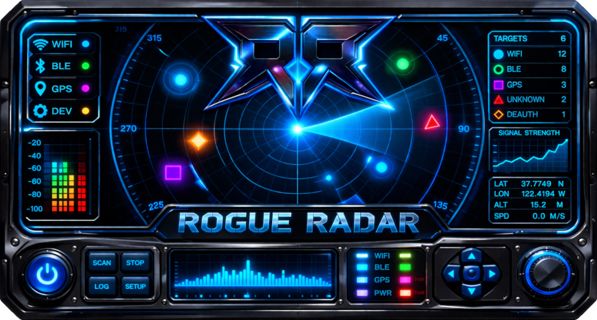
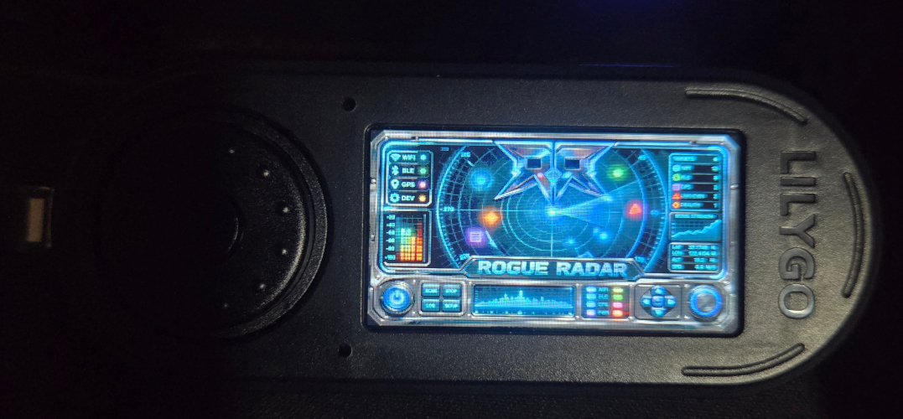
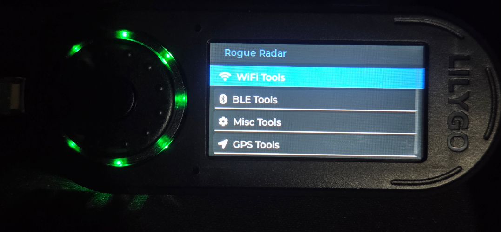
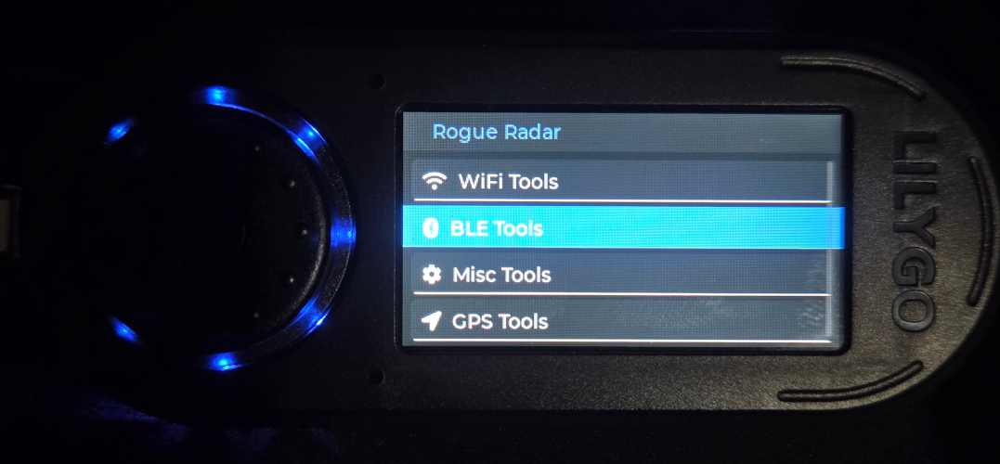
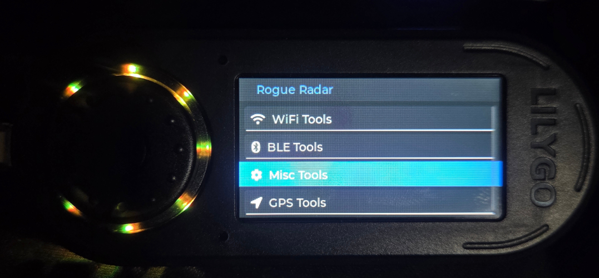
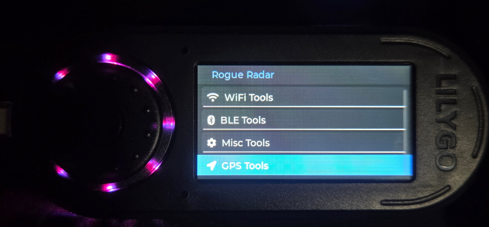

<p align="center">
  
</p>

<h1 align="center">Rogue Radar</h1>
<p align="center"><strong>ESP32-S3 multi-tool firmware for WiFi, BLE, GPS, and device utilities on the LilyGO T-Embed (non CC1101).</strong></p>

## 🧭 Version Tracker

| Version | Status | Notes |
|--------|--------|-------|
| v1.0.5 | Stable | Adds Smart Charger Monitor, adds Audio Tools with SD WAV saving, on-device recordings browser, selected-file playback, on-device delete, improved Sound Recorder SD diagnostics, and Sound Recorder UI/stability cleanup |
| v1.0.4 | Stable | Adds Audio Tools with Sound Recorder, Connect to AP, LAN Host Discovery, Gateway Info, WiFi Mapper, Station Scanner, Raven Detector, improved Flock detection, menu-based Power Off, and general UI/stability cleanup |
| v1.0.3 | Stable | Adds battery display, adds Menu Feedback Volume and Alert Sound Volume controls, adds Deauth Stats, expands Pwnagotchi Watch details, improves Device Info and other features, and fixes theme focus styling |
| v1.0.2 | Stable | Adds Packet Monitor with live graph and hop presets, Flock Hybrid, nyanBOX/Axon/Tesla detectors, improved AirTag/Flipper/Skimmer detection, extra themes, and menu cleanup |
| v1.0.1 | Stable | Adds display/LED dimming controls, scan defaults, rotation toggle, audio feedback, and improved Flock detection |
| v1.0.0 | Stable | Initial public release of the Rogue Radar Firmware |

> **Latest Release:** `v1.0.5` — Rogue Radar Firmware
---

## Overview

**Rogue Radar** is a handheld ESP32-S3 firmware built for the **LilyGO T-Embed** that combines multiple wireless and utility tools into one rotary-driven interface.

The firmware uses **LVGL** for the UI, **TFT_eSPI** for the 320x170 ST7789 display, **BLE + WiFi** features from the ESP32 core, **TinyGPS++** for GPS data, **APA102 LEDs** for visual status feedback, and optional I2S speaker output for alerts and menu feedback.

It is designed around fast menu navigation, onboard scanning tools, live signal data, GPS stats, SD-based update support, and a clean embedded dashboard feel.

## Screenshots

<p align="center">
  
  
  
</p>

<p align="center">
  
  
</p>

---

## Current Tool Set

### WiFi Tools
- **Network Scanner** – scans nearby access points and shows SSID, BSSID, RSSI, channel, and security type.
- **Connect to AP** – scans nearby access points, lets you select one, enter a password, connect to WiFi, and keep the connection available for connected tools.
- **LAN Host Discovery** – performs safe local subnet discovery using lightweight TCP checks and lists discovered LAN hosts.
- **Gateway Info** – shows connected network details such as SSID, signal, local IP, gateway, subnet, DNS, router TCP status, internet check, and station MAC.
- **Station Scanner** – passively scans for nearby WiFi station/client activity.
- **Deauth Detector** – monitors for deauthentication and disassociation activity using promiscuous mode, with live event tracking and a Deauth Stats view.
- **Channel Analyzer** – surveys channel activity and signal strength across WiFi channels.
- **Packet Monitor** – live WiFi packet monitor with channel selection, packet rate, packet type counts, average RSSI, optional channel hopping, and a live bar graph.
- **WiFi Mapper** – visual WiFi mapping-style scanner with RSSI scaling and speed presets.
- **PineAP Hunter** – watches for BSSIDs cycling through many SSIDs across scans.
- **Pwnagotchi Watch** – looks for Pwnagotchi beacon behavior, parses status data, and includes selectable results with a detail page showing name, type, pwnd total, RSSI, channel, MAC data, and raw preview.
- **Flock Detector** – flags WiFi activity associated with Flock-related SSID keywords, stronger ID patterns, MAC/OUI hints, adaptive dwell timing, and source MAC details.
- **Flock Hybrid** – combines BLE and WiFi Flock-style detection into one scanner with merged results and selectable scan presets.

### BLE Tools
- **BLE Scanner** – scans nearby Bluetooth Low Energy devices and lists signal details.
- **AirTag Detector** – identifies AirTag-like BLE activity using manufacturer data, UUID fallback, and passive Apple Find My / AirTag payload pattern detection.
- **Flipper Detector** – detects Flipper-style BLE devices using name matching, OUI fallback, and UUID detection for Black, White, and Transparent variants; results are selectable with a detail page.
- **nyanBOX Detector** – detects nyanBOX / Nyan Devices BLE badges and shows name, MAC, RSSI, level, version, age, and Locate Mode.
- **Axon Detector** – detects Axon-style BLE devices by configurable MAC/OUI prefix with detail view and Locate Mode.
- **Raven Detector** – passively detects Raven / SoundThinking-style BLE service UUID patterns and shows matching device details.
- **Tesla Detector** – detects Tesla-style BLE name patterns and shows name, MAC, RSSI, age, signal quality, and detail view.
- **Skimmer Detector** – checks for suspicious BLE serial/module names including HC-03, HC-05, HC-06, HC-08, BT-HC05, JDY-31, AT-09, HM-10, CC41-A, MLT-BT05, SPP-CA, and FFD0.
- **Meta Detector** – looks for Meta / Ray-Ban smart-glasses related BLE advertisements.

### GPS Tools
- **GPS Stats** – displays live latitude, longitude, speed, altitude, and satellite data.
- **Wiggle Wars** – included as a GPS menu item for expansion / custom use.

### Audio Tools
- **Sound Recorder** – records from the T-Embed ES7210 microphone into RAM, supports manual Record/Stop, playback through the I2S speaker, playback speed tuning, and a scroll-ready layout for future recording file browsing.

### Misc Tools
- **Battery Display** – shows battery percentage in the top bar with a shared/stable display value across menus.
- **Device Info** – scrollable device information page showing firmware version, device type, chip, flash, heap, CPU, battery details, MAC addresses, and eFuse ID.
- **SD Update** – supports firmware update flow from SD card.
- **Brightness** – adjusts the TFT backlight with PWM brightness control.
- **Themes** – switches between built-in UI themes including Dark, Flipper, Matrix, Poseidon, Phantom, Amber, Tron, TypeR, and Joker.
- **Scan Defaults** – adjusts BLE scan time, WiFi scan time, WiFi result limit, deauth hop timing, Flock Hybrid presets, Packet Monitor hopping ON/OFF, and Packet Monitor hop timing for the current session.
- **Dimming** – toggles inactivity-based screen and APA102 LED dimming.
- **LEDs** – toggles the APA102 ring on or off at runtime.
- **Rotation** – switches between normal and flipped landscape orientations.
- **Alert Sound** – toggles detection alert chirps.
- **Alert Volume** – adjusts detection alert chirp volume with a bar-style control.
- **Menu Sounds** – toggles encoder/menu feedback sounds separately from detection alerts.
- **Menu Volume** – adjusts encoder/menu feedback volume with a bar-style control.
- **Reset Settings** – clears saved runtime preferences and restores default settings.
- **Power Off** – safely powers down from the menu instead of using GPIO0 long-hold shutdown.

---

## Hardware Target

This firmware is currently built around the **LilyGO T-Embed ESP32-S3 (Non CC1101)**.

### Main hardware used
- **ESP32-S3 T-Embed**
- **ST7789 320x170 display**
- **Rotary encoder + encoder push button**
- **APA102 LED ring**
- **GPS module over UART**
- **MicroSD card on dedicated HSPI bus**
- **Optional I2S speaker output**

---

## Arduino IDE Setup

### User_Setup Files
Make a backup of your files before replacing any. Drop the corresponding file/s (found above) for your device into `C:\Users\YOURUSERNAME\Documents\Arduino\libraries\TFT_eSPI-master`. And make sure you choose the correct file in the `User_Setup_Select.h` file.

| File Name |
|---|
| `User_Setup_CYD.h` |
| `User_Setup_CYD2USB.h` |
| `User_Setup_LilyGo_T_Embed_S3.h` |
| `User_Setup_nm_cyd_c5.h` |
| `User_Setup_Select.h` |

### Board settings
- **Board:** `ESP32S3 Dev Module`
- **Partition Scheme:** `Huge APP`

### Required libraries
- `TFT_eSPI`
- `lvgl` (the sketch notes target **9.0.0**)
- `RotaryEncoder` by mathertel
- `APA102` by Pololu
- `TinyGPSPlus`

### ESP32 core features used
- `WiFi`
- `esp_wifi`
- `BLEDevice`
- `BLEScan`
- `SD`
- `Update`
- `driver/i2s`

---

## LVGL Notes

Make sure your `lv_conf.h` has these enabled:

```cpp
#define LV_COLOR_DEPTH 16
#define LV_USE_LIST    1
#define LV_USE_LABEL   1
#define LV_USE_BTN     1
#define LV_USE_BAR     1
```

---

## TFT / Display Notes

The firmware is written for a **320x170** layout and uses **TFT_eSPI**.
You will need a correct `User_Setup.h` for your T-Embed display configuration.

The sketch also includes a splash screen system using:
- `splash.h`
- `SPLASH_TIME_MS`

---

## Pin Overview

<details>
<summary><strong>GPS</strong></summary>

- `GPS_RX_PIN 44`
- `GPS_TX_PIN 43`

</details>

<details>
<summary><strong>SD Card (HSPI)</strong></summary>

- `SD_CS   39`
- `SD_SCLK 40`
- `SD_MISO 38`
- `SD_MOSI 41`

</details>

<details>
<summary><strong>Device / UI</strong></summary>

- `POWER_PIN   46`
- `LCD_BL_PIN  15`
- `ENCODER_A   1`
- `ENCODER_B   2`
- `ENCODER_BTN 0`

</details>

<details>
<summary><strong>APA102</strong></summary>

- `APA102_DI  42`
- `APA102_CLK 45`

</details>

<details>
<summary><strong>I2S Speaker</strong></summary>

- `SOUND_I2S_BCLK 7`
- `SOUND_I2S_WCLK 5`
- `SOUND_I2S_DOUT 6`

</details>

---

## UI / Controls

Rogue Radar is built around a **rotary encoder driven interface** using LVGL input groups.

### Controls
- **Rotate encoder** to move through menus and lists
- **Press encoder** to select items
- **Hold encoder button for 5 seconds** to trigger power-off handling

The APA102 LEDs are also used for menu color feedback and scan animations. Optional speaker feedback can provide detection chirps and quiet menu tick/click sounds.

---

## Features at a Glance

- Multi-category tool layout
- WiFi scanning and monitoring tools
- BLE scanning and device-type detection
- GPS live stats
- SD card firmware update path
- Adjustable display brightness and inactivity dimming
- Runtime toggles for dimming, LEDs, sound, menu sounds, and display rotation
- Session-adjustable scan defaults
- LED ring startup and scanning effects
- Optional detection alert chirps
- Splash screen support
- Embedded dashboard-style UI

---

## Arduino Installation

__METHOD 1__
1. Open the sketch in **Arduino IDE**.
2. Install the required libraries.
3. Make sure `TFT_eSPI` is configured for your **LilyGO T-Embed**.
4. Make sure your `lv_conf.h` options are enabled.
5. Add your `splash.h` file if you are using the splash screen.
6. Select **ESP32S3 Dev Module**.
7. Set partition scheme to **Huge APP**.
8. Compile and flash.

__METHOD 2__ <br>

## Web Flash Tool

<a href="https://atomnft.github.io/Rogue-Radar/flash0.html" target="_blank" rel="noopener noreferrer">
  
</a>

---

## Roadmap Ideas

- Add logging/export for scan results
- Add richer BLE classification and filtering
- Expand GPS tool set
- Add more SD card utilities
- Add icon assets and polish for each tool page

---

## Disclaimer

This project is intended for educational, research, and defensive awareness purposes. Be responsible, follow local laws, and only use wireless analysis features where you are authorized to do so.

---

## Credits

Rogue Radar would not be possible without the work and inspiration from these projects and creators:

- **JustCallMeKoKo / ESP32Marauder**  
  Huge credit to JustCallMeKoKo for the continued work on ESP32Marauder and for helping push ESP32-based WiFi/BLE research tools forward.  
  https://github.com/justcallmekoko/ESP32Marauder

- **jbohack / nyanBOX**  
  Big credit to jbohack for the nyanBOX hardware and firmware work, which helped inspire several BLE-focused ideas and detector improvements in Rogue Radar.  
  https://github.com/jbohack/nyanBOX

- **spacehuhn / PacketMonitor32**  
  Credit to spacehuhn for PacketMonitor32, which inspired the live Packet Monitor feature and WiFi packet activity graph in Rogue Radar.  
  https://github.com/spacehuhn/PacketMonitor32

- **GhostESP Revival**  
  Credit to the GhostESP Revival project for BLE detection ideas that helped improve AirTag-like, Flipper, and skimmer-style detection logic.  
  https://github.com/GhostESP-Revival/GhostESP

- **Esp32vsEvil / TeslaScanner**  
  Credit to Esp32vsEvil for the TeslaScanner idea that inspired the Tesla BLE detector added to Rogue Radar.  
  https://github.com/Esp32vsEvil/TeslaScanner
  
- **0xXyc / flock-you-wifi-recon**  
  Credit to 0xXyc for the flock-you-wifi-recon project, which helped inspire Rogue Radar’s expanded Flock detection improvements, including Flock-related MAC/OUI matching, confidence labels, method labels, BLE manufacturer ID checks, and improved Flock Hybrid detail handling. This project is also helping guide the upcoming Raven Detector feature planned for Rogue Radar.  
  https://github.com/0xXyc/flock-you-wifi-recon